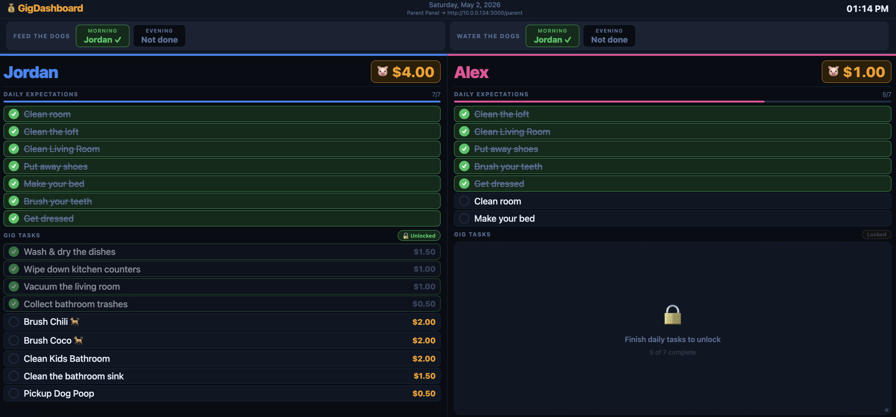
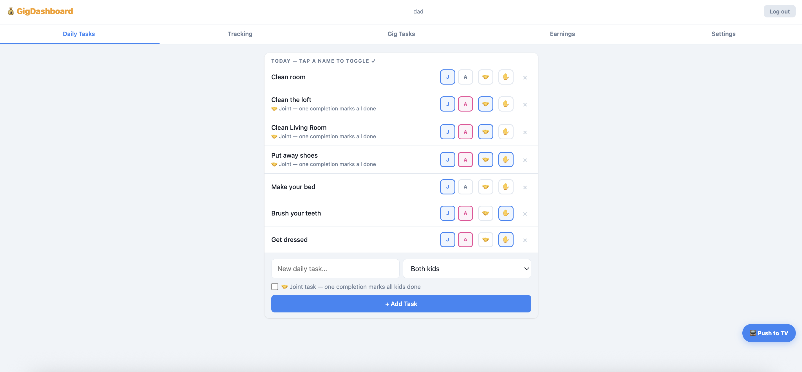
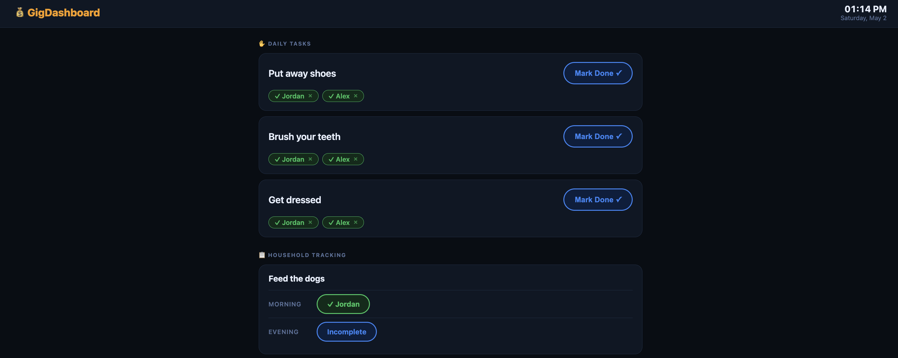

# GigDashboard

A household chore and earnings tracker for kids. Built for a TV-connected display with a mobile parent control panel and a touch-friendly kids tablet page.


---

## Screenshots

| TV Dashboard | Parent Panel | Kids Tablet |
|:---:|:---:|:---:|
|  |  |  |

---

## Features

### TV Dashboard (`/tv`)
- Full-screen display, one column per kid, scales to any number of kids
- Completed tasks float to the top of each list so remaining work is immediately visible
- Auto-reloads after server updates to clear stale JS
- Pixel shift animation (2px, 10-minute cycle) to prevent screen burn-in

### Daily Expectations
- Tasks that must be completed before gig tasks unlock per kid
- **Joint tasks** — one completion by any kid marks the task done for everyone (great for shared chores like tidying the living room)
- **Tablet self-service** — mark individual tasks as self-service so kids can complete them from the tablet without parent involvement

### Gig Tasks
- Paid chores with dollar values; first-come-first-served between kids
- Types: **Weekly** (rolling 7 days), **Bi-weekly** (14 days), or **Permanent**
- **Parent-handled** — parent can claim a gig task to prevent kids from taking credit (e.g. parent did it themselves)
- **Inline editing** — rename or change the payout of any incomplete gig task directly from the parent panel

### Tracking Tasks
- Two-step non-gating tasks (e.g. Feed the dogs — Morning / Evening)
- Assignable to a kid or a parent per step

### Piggy Bank & Earnings
- Running earnings total per kid displayed on the TV dashboard
- **Manual transactions** — add or deduct money with an optional note (e.g. specialty coffee, store purchase)
- Full transaction history visible in the Earnings tab
- Cash-out resets the piggy bank to $0 and clears all history

### Kids Tablet (`/kids`)
- Touch-optimized interface for kids to self-complete trusted daily tasks and tracking steps
- Full-name verification before marking anything complete
- No login required — designed for a shared tablet on the home network

### Parent Panel (`/parent`)
- Mobile-friendly web app with JWT login
- Tabs: Daily Tasks, Tracking, Gig Tasks, Earnings, Settings
- **Settings tab:**
  - Kid management — rename, recolor (10 options), add, remove
  - Password change and recovery code generation
  - WiFi wizard (scan, select, connect without SSH)
  - Display sleep schedule — auto-sleep/wake on a daily timer (non-Docker only)
  - In-app updates — pull the latest version from GitHub and restart with one tap
  - Device controls — Reload TV, Reboot, Shutdown

---

## Running with Docker

> **Note:** Docker support is included but has not been end-to-end tested. If you run into issues please open a GitHub issue.
> The display sleep schedule is not available in Docker deployments.

### Quick start

```bash
curl -O https://raw.githubusercontent.com/its-cb/GigDash/main/docker-compose.yml
JWT_SECRET=$(openssl rand -hex 32) docker-compose up -d
```

The app will be available at:
- TV Dashboard → `http://<host-ip>:3000/tv`
- Parent Panel → `http://<host-ip>:3000/parent`
- Kids Tablet → `http://<host-ip>:3000/kids`

### First-time setup

After the container starts, seed the database with your kids' names, default tasks, and parent logins:

```bash
docker exec -e KID1_NAME="Alex" -e KID2_NAME="Jordan" gigdash node db/seed.js
```

Replace `Alex` and `Jordan` with your kids' names. This only needs to be run once — the database persists in a Docker volume and won't be re-seeded on updates.

Default logins: `dad / parent123` and `mom / parent123` — change these in the Settings tab after first login.

### Environment variables

| Variable | Default | Description |
|---|---|---|
| `PORT` | `3000` | Port the server listens on |
| `JWT_SECRET` | `change-me-in-production` | Secret for signing auth tokens — **always set this** |
| `DB_PATH` | `/app/data/gigdash.db` | Path to the SQLite database file |

### Updating

```bash
docker-compose pull && docker-compose up -d
```

The database is stored in a Docker volume (`gigdash-data`) and survives updates.

---

## Running without Docker

### Deploy to a Linux box from your Mac (recommended)

This is the simplest path for a dedicated device — a mini PC, NUC, Raspberry Pi, or anything connected to a TV.

**Supported:** Debian 13 (Trixie), Raspberry Pi OS, and any modern Debian-based distro.

**1. Clone the repo on your Mac**
```bash
git clone https://github.com/its-cb/GigDash.git
cd GigDash
```

**2. Add a shell function for easy deploys**
```bash
echo 'deploygigdash() { bash ~/path/to/GigDash/deploy.sh "${@}"; }' >> ~/.zshrc
source ~/.zshrc
```

**3. Install the OS on your device** with only the SSH server option selected. Make sure it's on the same network as your Mac.

**4. Run the deploy script**
```bash
deploygigdash <device-ip> <username>
# Example: deploygigdash 192.168.1.50 gigdash
```

This zips the project, transfers it to the device, and runs the full setup automatically. On first install it will ask for your kids' names, then handle everything else — Node.js, dependencies, systemd service, and Chromium kiosk mode.

**5. On subsequent updates**, pull and redeploy:
```bash
git pull && deploygigdash <device-ip> <username>
```

The database is preserved between deploys — only code files are updated.

> **Tip:** Once deployed, you can apply future updates directly from the **Settings → Updates** tab in the parent dashboard without needing to redeploy from your Mac. The TV auto-reloads after each update to clear any cached JS.

See [SETUP.md](SETUP.md) for full details including systemd configuration, kiosk mode, and optional nginx setup.

---

## First-time WiFi setup

If your device is connected via ethernet and you want to switch to WiFi, you can configure it from the parent dashboard without SSH:

1. Open the parent dashboard on any device connected to the same network
2. Go to **Settings → WiFi**
3. Tap **Scan** to see nearby networks, or **Enter network manually** for hidden SSIDs
4. Select your network, enter the password, and tap **Connect**
5. Once connected, unplug the ethernet cable

---

## Managing kids

Kids are managed directly from the **Settings tab** in the parent dashboard — no command line needed. You can:

- Rename any kid
- Change their color (10 color options)
- Add new kids
- Remove a kid (clears all their task history)

The TV dashboard automatically adjusts its layout to however many kids are configured.

---

## Password recovery

If you get locked out, use a recovery code to reset your password:

1. Go to the parent login page and tap **Forgot password?**
2. Enter your username, recovery code, and a new password

To generate a recovery code while logged in, go to **Settings → Recovery Code → Generate**. Store the code somewhere safe — it's only shown once. You can regenerate a new one any time you're logged in.

---

## Tech stack

- **Backend** — Node.js, Express, SQLite (better-sqlite3)
- **Auth** — JWT + bcrypt
- **Frontend** — Vanilla HTML/CSS/JS (no build step)
- **Database** — SQLite, auto-migrated on startup
